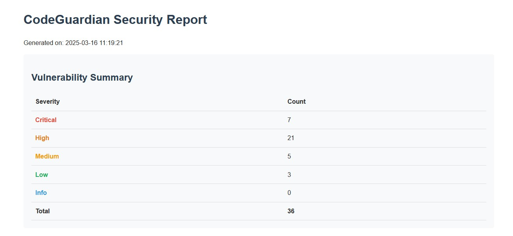
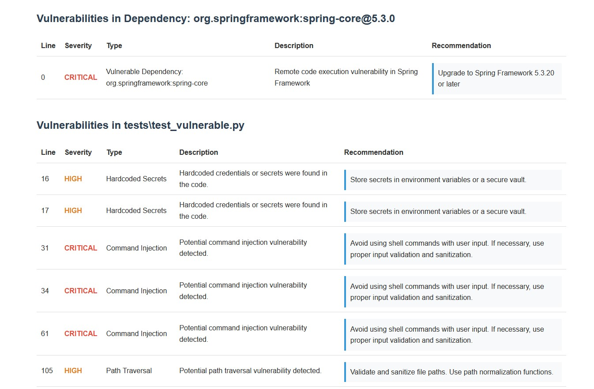

# CodeGuardian


CodeGuardian is an advanced static code analysis tool designed to identify security vulnerabilities, code quality issues, and potential bugs in your codebase. It supports multiple programming languages including Python, JavaScript, and Java.

## Example Report

CodeGuardian generates comprehensive security reports that highlight vulnerabilities in your code. Here are examples of what the HTML report looks like:

### Vulnerability Summary

The report provides a clear overview of all vulnerabilities found, categorized by severity level:



### Detailed Vulnerability Analysis

Each file is analyzed in detail, showing specific vulnerabilities with line numbers, severity, and recommendations:



The report includes:
- **Dependency Vulnerabilities**: Identifies vulnerable packages like django@3.1.0, express@4.17.1, lodash@4.17.20
- **Code Vulnerabilities**: Detects issues like SQL injection, command injection, hardcoded secrets
- **Line-specific Information**: Points to exact line numbers where vulnerabilities exist
- **Remediation Advice**: Provides specific recommendations for fixing each issue

You can generate this report yourself by running:

```bash
python run.py scan tests --output html --output-file report.html
```

### Viewing the Report

After generating the HTML report, you can open it in any web browser:

```bash
# On Windows
start report.html

# On macOS
open report.html

# On Linux
xdg-open report.html
```

The report is self-contained and can be shared with team members or stakeholders who need visibility into the security posture of your codebase.

## Features

- **Multi-language Support**: Analyze Python, JavaScript, Java, and more
- **Comprehensive Vulnerability Detection**: Identifies OWASP Top 10 vulnerabilities
- **Dependency Scanning**: Checks for vulnerable dependencies in your project
- **Pattern-based Analysis**: Uses sophisticated pattern matching to find code smells and security issues
- **Detailed Reports**: Generates comprehensive reports with severity ratings and remediation suggestions
- **Multiple Output Formats**: Generate reports in Console, HTML, JSON, or Markdown formats
- **Low False Positive Rate**: Advanced algorithms minimize false positives

## Installation

```bash
# Clone the repository
git clone https://github.com/MatthewHJS/CodeGuadrian
cd CodeGuardian

# Install the package in development mode
pip install -e .

# Set up your OpenAI API key
# For Linux/Mac
export OPENAI_API_KEY=your_api_key_here

# For Windows
set OPENAI_API_KEY=your_api_key_here

# Or create a .env file in the project root
# OPENAI_API_KEY=your_api_key_here
```

## Usage

### Basic Usage

```bash
# Using the run.py script (recommended)
python run.py scan /path/to/your/project

# Or if the command-line tool is properly installed
codeguardian scan /path/to/your/project
```

### Specify Languages

```bash
python run.py scan /path/to/your/project --languages python,javascript
```

### Generate Reports in Different Formats

```bash
# HTML Report
python run.py scan /path/to/your/project --output html --output-file report.html

# JSON Report
python run.py scan /path/to/your/project --output json --output-file report.json

# Markdown Report
python run.py scan /path/to/your/project --output markdown --output-file report.md
```

### Exclude Directories

```bash
python run.py scan /path/to/your/project --exclude tests,vendor
```

### Set Minimum Severity Level

```bash
python run.py scan /path/to/your/project --severity medium
```

## Configuration

Create a `.codeguardian.yml` file in your project root to customize the analysis:

```yaml
exclude:
  - tests/
  - vendor/
  - node_modules/

severity_threshold: medium

languages:
  - python
  - javascript
  - java
```

## How It Works

CodeGuardian uses a combination of static analysis techniques:

1. **SAST (Static Application Security Testing)**: Analyzes source code for security vulnerabilities
2. **Dependency Scanning**: Checks libraries and dependencies against vulnerability databases
3. **Pattern Matching**: Uses sophisticated regex and AST-based pattern matching to identify code issues
4. **AI-Powered Analysis**: Leverages OpenAI's capabilities to provide intelligent vulnerability detection

## Test Files

The repository includes test files with intentional vulnerabilities to demonstrate the tool's capabilities:

- `tests/test_vulnerable.py`: Python vulnerabilities
- `tests/test_vulnerable_js.js`: JavaScript vulnerabilities
- `tests/test_vulnerable_java.java`: Java vulnerabilities

These files are for demonstration purposes only and should never be used in production.

## Contributing

Contributions are welcome! Please feel free to submit a Pull Request.

## License

This project is licensed under the MIT License - see the LICENSE file for details.